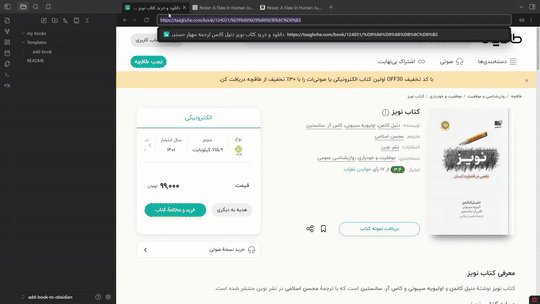

# add book to obsidian

با استفاده از این اسکریپت میتونید در نرم افزار ابسیدین اطلاعات کتاب رو از سایت های مختلف استخراج کرده و در یک فایل ذخیره کنید. 



## ✨ متغیر‌های قابل دریافت
- 📕 عنوان کتاب
- 👤 نام نویسنده
- 📄 تعداد صفحات
- 🖼️ تصویر کتاب

<br>

## 🌐 سایت‌های پشتیبانی شده
-  [طاقچه](https://taaghche.com/)
-  [فیدیبو](https://fidibo.com/)
-  [بهخوان](https://behkhaan.ir/)
-  [گودریدز](https://www.goodreads.com/)
-  [آمازون](https://www.amazon.com/)

<br>

## 🛠️ روش استفاده

https://github.com/user-attachments/assets/29cf032f-6488-4f3a-8e6e-c6b1369e9570

1. یک پوشه به اسم Templates و یک پوشه به اسم my books ایجاد کنید.
2. فایل add-book.md رو از [اینجا](./Templates/add-book.md) دانلود کنید و توی پوشه Templates قرار بدید.
3. پلاگین [Templater](https://obsidian.md/plugins?id=templater-obsidian) رو نصب کنید.
4. از بخش تنظیمات پلاگین گزینه Tigger templater on new file رو فعال کنید.
5. روی گزینه add new folder template کلیک کنید.
6. در فیلد Folder پوشه my books رو انتخاب کنید.
7. در فیلد Template فایل add-book رو انتخاب کنید.
8. از تنظیمات خارج بشید. روی پوشه my book راست کلیک کنید و گزینه new note رو انتخاب کنید.
9. لینک کتاب رو وارد کنید و اینتر بزنید.

تمام! یک فایل جدید با اطلاعات کتاب براتون ساخته میشه.

<br>

<details dir="rtl" style="border-radius: 10px; padding: 1em; background-color: #a3a3a31a;"><summary><h3>🚀 ساخت شورتکات</h3></summary>
از پلاگین quick add هم میتونید استفاده کنید. براتون یه دستور جدید میسازه و اجازه میده براش شورتکات مشخص کنید. 
<br>

https://github.com/user-attachments/assets/42b99ec3-c517-44ff-b15e-11684298ffcb

<ol>
  <li>پلاگین <a href="https://obsidian.md/plugins?id=quickadd">quick add</a> رو نصب کنید و وارد تنظیمات پلاگین بشید.</li>
  <li>در فیلد name یک اسم انتخاب کنید، مثلا add book.</li>
  <li>حالت Template رو انتخاب کنید و گزینه Add choice رو بزنید.</li>
  <li>یک ردیف جدید ساخته میشه. روی آیکون تنظیمات ⚙️ بزنید.</li>
  <li>از بخش Template Path تمپلیت add book رو انتخاب کنید.</li>
  <li>گزینه File name Format رو فعال کنید اما فیلدش رو خالی بگذارید.</li>
  <li>گزینه Create in folder رو فعال کنید و در فیلد Folder path پوشه my books رو انتخاب کنید.</li>
  <li>گزینه Open رو فعال کنید که بعد از اضافه کردن فایلش رو باز کنه.</li>
  <li>از تنظیمات خارج بشید، آیکون⚡رو فعال کنید.</li>
  <li>حالا از بخش Hotkeys در تنظیمات ابسیدین میتونید برای دستور add book یک شورتکات مشخص کنید.</li>
</ol>
</details>

<br>

## 📝 شخصی‌سازی

متغیر هایی خروجی این موارد هستند:

|        | Variable           |
| ------ | ------------------ |
| title  | ${bookData.title}  |
| author | ${bookData.author} |
| pages  | ${bookData.pages}  |
| cover  | ${bookData.cover}  |

این عبارات رو هر جایی قرار بدید معادل اطلاعاتش رو از سایت استخراج میکنه. تمپلیت دلخواه تون رو باید در بخش خروجی نهایی در خط `tR +=` بین دو بک تیک قرار بدید. به این شکل:
```js
// ==== خروجی نهایی ====
tR += `

محل قرار گیری تمپلیت شما
عنوان کتاب : ${bookData.title}
تصویر کتاب: 

`;
```

اگر میخواید توی بخش پراپرتی ها باشه مثل حالت پیشفرض باید سه تا خط تیره اضافه کنید و پراپرتی ها رو بنویسید و متغیر رو جلوش وارد کنید.

<br>

> ⚠ من این اسکریپت رو برای نیاز شخصی خودم با کمک DeepSeek درست کردم. متغیرها و سایت‌های فعلی برای کار من کفایت میکنه. اگر شما به موارد بیشتری نیاز دارید میتونید خودتون با کمک هوش مصنوعی امکانات بیشتری بهش اضافه کنید.

<br>

---


اگر به مطالب مرتبط با نرم‌افزار ابسیدین علاقه دارید می توانید به  [بلاگ](https://ifard.ir/) یا کانال  [تلگرامم](https://t.me/ifard_ir/) مراجعه کنید. 

